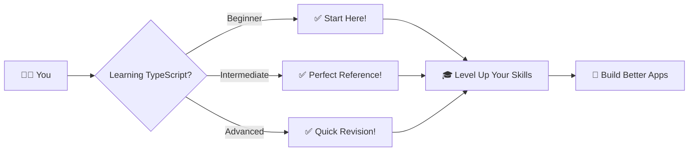
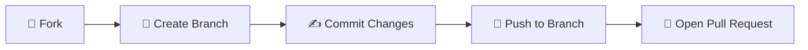

<div align="center">

<!-- Hero Section -->


# 𝕋𝕪𝕡𝕖𝕊𝕔𝕣𝕚𝕡𝕥 𝕃𝕖𝕒𝕣𝕟𝕚𝕟𝕘 ℕ𝕠𝕥𝕖𝕤

### *Master TypeScript with Crystal-Clear Documentation*

[](https://www.typescriptlang.org/)
[](https://github.com/riteshpatel1984)
[](https://github.com/riteshpatel1984/typescript/pulls)
[](https://opensource.org/licenses/MIT)

<p align="center">
  <a href="#-about">About</a> •
  <a href="#-topics-covered">Topics</a> •
  <a href="#-getting-started">Getting Started</a> •
  <a href="#-repository-structure">Structure</a> •
  <a href="#-contributing">Contributing</a>
</p>

</div>

---

## 🎯 About

<table>
<tr>
<td>

**Welcome to my comprehensive TypeScript learning repository!** 

This isn't just another code dump — it's a carefully curated collection of notes designed with **clarity** and **practicality** in mind. Whether you're a complete beginner or brushing up on fundamentals, these notes cut through the noise and get straight to what matters.

> **💡 Philosophy:** *"The best documentation is the one you actually want to read."*

**What makes this different?**
- ✨ No unnecessary jargon
- 🎯 Real-world examples
- 🚀 Production-ready patterns
- 📖 Easy to understand explanations

</td>
</tr>
</table>

---

## 📚 Topics Covered

<div align="center">

| 🔷 Topic | 📝 Description | 📁 File |
|:---------|:---------------|:--------|
| **Basics** | Variables, types, and configuration fundamentals | `README.md` |
| **Annotations** | Type annotations vs. inference | `Annotation_Inference.ts` |
| **Type Narrowing** | Refining types for type safety | `Type narrowing.ts` |
| **Arrays** | Working with typed arrays | `array.ts` |
| **Enums** | Enumerated types and their use cases | `enum.ts` |
| **Functions** | Function signatures and overloads | `function.ts` |
| **Generics** | Creating flexible, reusable components | `generic.ts` |
| **Interfaces** | Defining contracts for objects | `interface.ts` |
| **Advanced Types** | Union types, intersections, and more | `moreTypescriptTypes.ts` |
| **Objects** | Typing complex object structures | `objects.ts` |
| **OOP** | Object-oriented programming in TypeScript | `oops.ts` |
| **Web Requests** | Typing HTTP requests and responses | `webReq.ts` |

</div>

---

## 🌟 Why This Repository?

<div align="center">



</div>

<table align="center">
<tr>
<td align="center" width="25%">
<br>
<sub><b>Beginner Friendly</b></sub><br>
<sup>Start from scratch with confidence</sup>
</td>
<td align="center" width="25%">
<br>
<sub><b>Quick Reference</b></sub><br>
<sup>Find what you need instantly</sup>
</td>
<td align="center" width="25%">
<br>
<sub><b>Clear Examples</b></sub><br>
<sup>Learn by doing with real code</sup>
</td>
<td align="center" width="25%">
<br>
<sub><b>Production Ready</b></sub><br>
<sup>Best practices included</sup>
</td>
</tr>
</table>

---

## 🚀 Getting Started

<details open>
<summary><b>📥 Installation & Setup</b></summary>
<br>

```bash
# Clone this repository
git clone https://github.com/riteshpatel1984/typescript.git

# Navigate to the directory
cd typescript

# Install TypeScript (if not already installed)
npm install -g typescript

# Explore the files
ls -la
```

</details>

<details>
<summary><b>🎓 How to Use These Notes</b></summary>
<br>

1. **Start with the basics** - Open `README.md` for an overview
2. **Pick a topic** - Choose from the files based on what you want to learn
3. **Read & Practice** - Each file contains explanations and code examples
4. **Experiment** - Modify the code and see what happens
5. **Build Projects** - Apply what you've learned in real applications

</details>

---

## 📂 Repository Structure

```
📦 typescript/
┣ 📜 README.md                    # You are here!
┣ 📘 Annotation_Inference.ts      # Type annotations & inference
┣ 📘 Type narrowing.ts            # Narrowing types safely
┣ 📘 array.ts                     # Array types & operations
┣ 📘 enum.ts                      # Enumerated types
┣ 📘 function.ts                  # Function typing
┣ 📘 generic.ts                   # Generic programming
┣ 📘 interface.ts                 # Interface definitions
┣ 📘 moreTypescriptTypes.ts       # Advanced type features
┣ 📘 objects.ts                   # Object typing
┣ 📘 oops.ts                      # OOP in TypeScript
┗ 📘 webReq.ts                    # HTTP request typing
```

---

## 🤝 Contributing

<div align="center">

**Contributions make the open-source community amazing! Any contributions you make are greatly appreciated.**

</div>



### Steps to Contribute:

1. 🍴 Fork the Project
2. 🌿 Create your Feature Branch (`git checkout -b feature/AmazingFeature`)
3. ✍️ Commit your Changes (`git commit -m 'Add some AmazingFeature'`)
4. 🚀 Push to the Branch (`git push origin feature/AmazingFeature`)
5. 🎉 Open a Pull Request

---

## 💎 Show Your Support

<div align="center">

**If this repository helped you, give it a ⭐!**

[](https://github.com/riteshpatel1984/typescript/stargazers)
[](https://github.com/riteshpatel1984/typescript/network/members)
[](https://github.com/riteshpatel1984/typescript/watchers)

</div>

---

## 📞 Connect & Support

<div align="center">

**Have questions? Found a bug? Want to chat about TypeScript?**

[](https://github.com/riteshpatel1984/typescript/issues)
[](https://github.com/riteshpatel1984/typescript/discussions)

</div>

---

## 📄 License

<div align="center">

This project is licensed under the **MIT License** - see the [LICENSE](LICENSE) file for details.

```
MIT License - Feel free to use this project for learning and building!
```

</div>

---

<div align="center">

## 🎨 Built With


---

### 🌟 **"Code is like humor. When you have to explain it, it's bad." – Cory House**

---

<sub>Made with 💙 by [riteshpatel1884](https://github.com/riteshpatel1884)</sub>

<sup>⭐ Star this repo if you found it helpful! ⭐</sup>

**[⬆ Back to Top](#-typescript-learning-notes)**

</div>
